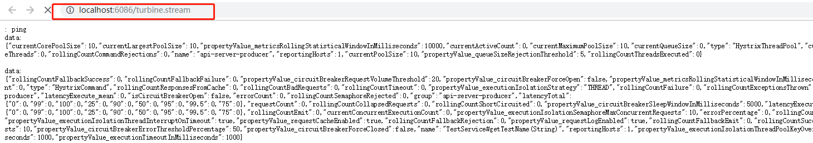
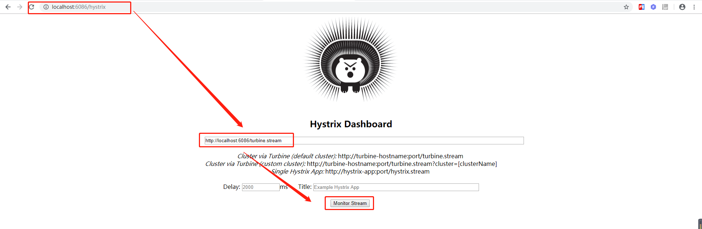
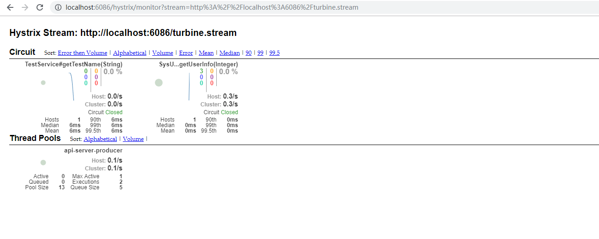

# kmc-api 服务

## kmc-api 监控服务消费者各个server节点

## 第一步：访问服务消费者

### 访问路径 http://localhost:6086/turbine.stream   其中 6086 为服务消费者server.port~~

## 第二步： 进入监控页面
### 访问 http://localhost:6086/hystrix ，将第一步监控数据的网址输入，点击Monitor Stream

## 监控页面

